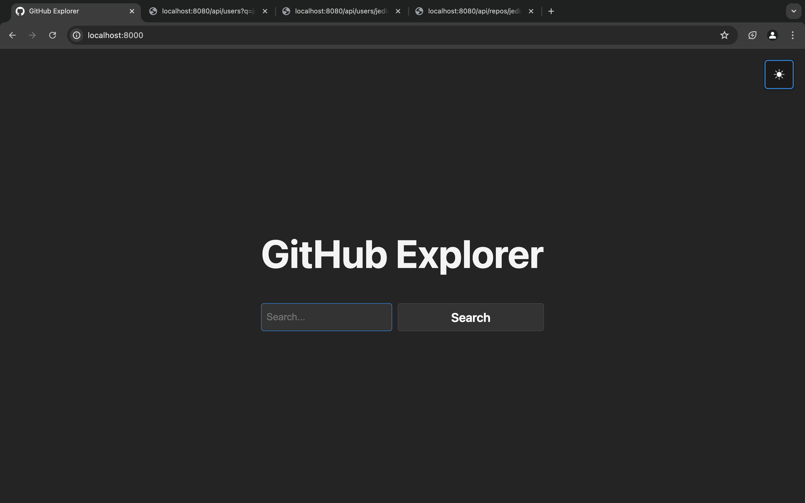
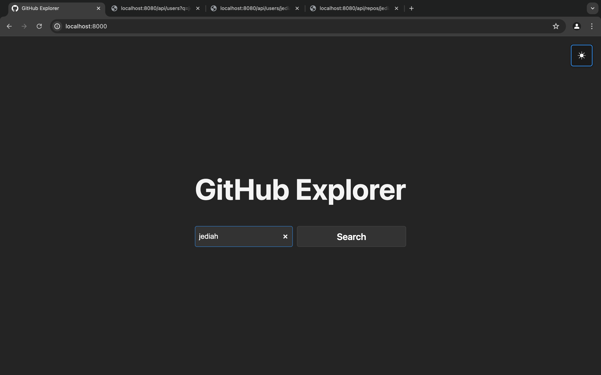

# GitHub Explorer

GitHub Explorer is a full-stack web application that allows users to search for GitHub users and view their repositories. The application is built using React for the frontend and Express for the backend. It integrates with the GitHub API to fetch data.

## Table of Contents

- [Project Structure](#project-structure)
- [Features](#features)
- [Installation](#installation)
- [Usage](#usage)
- [Screenshots](#screenshots)
- [Contributing](#contributing)

## Project Structure

```
github-explorer/
├── README.md
├── backend
│   ├── README.md
│   ├── app.js
│   ├── config
│   │   └── config.js
│   ├── docs
│   ├── frontend
│   │   ├── README.md
│   │   ├── babel.config.cjs
│   │   ├── docs
│   │   ├── index.html
│   │   ├── jest-setup.js
│   │   ├── jest.config.cjs
│   │   ├── package.json
│   │   ├── src
│   │   │   ├── App.jsx
│   │   │   ├── api.jsx
│   │   │   ├── components
│   │   │   ├── main.jsx
│   │   │   └── styles
│   │   ├── tests
│   │   └── vite.config.js
│   ├── package.json
│   ├── server.js
│   └── tests
```

## Features

- Search for GitHub users
- View user details
- View repository details
- Responsive design
- Light and dark mode functionality

## Installation

Clone the repository:

```sh
  git clone https://github.com/jediahjireh/github-explorer.git
  cd github-explorer
```

## Usage

### Starting the Backend

Navigate to the backend directory and start the server:

```sh
cd backend
npm start
```

### Starting the Frontend

In a new terminal window, navigate to the frontend directory and run the development server:

```sh
cd frontend
npm run dev
```

Open your browser and navigate to `http://localhost:8000`.

## Screenshots

View attached screenshots of the project in action.

### GitHub Explorer




### GitHub Search




### Search Results


### User Details


### User's Repositories


### Repository Details


## Contributing

Contributions are welcome! Please fork the repository and create a pull request.
