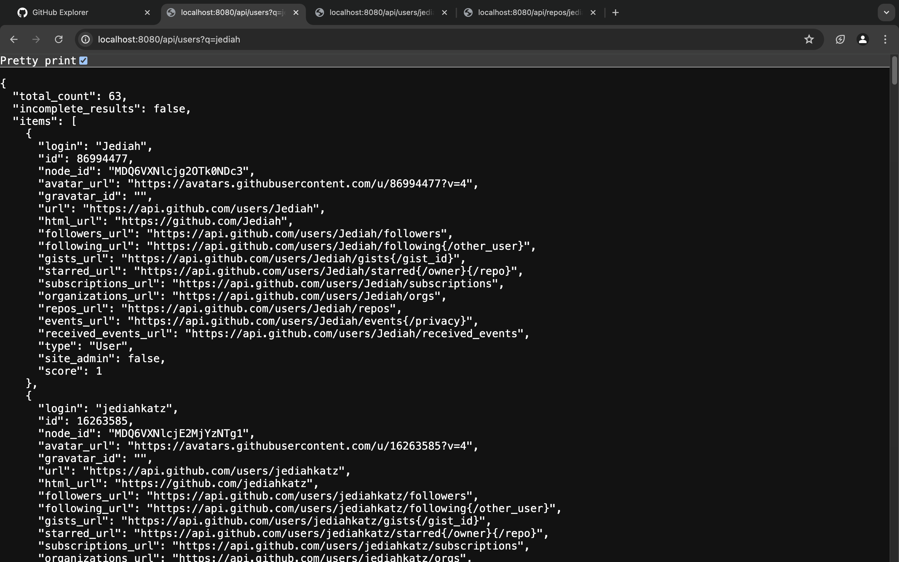
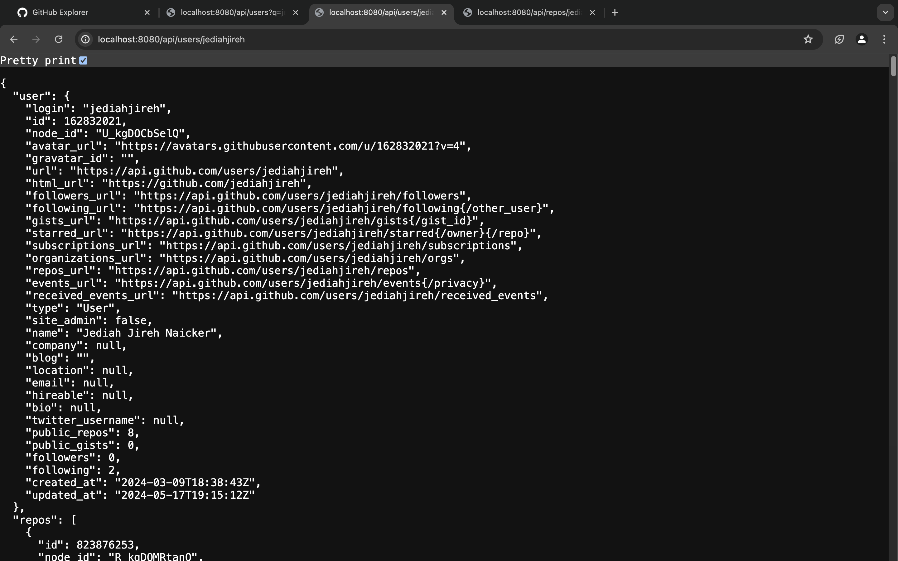
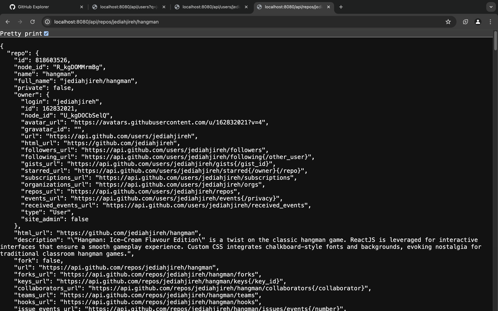

# GitHub Explorer Backend

This is the backend for the GitHub Explorer project, built with Express. It provides API endpoints to search for GitHub users, retrieve user details and fetch repository details along with recent commits.

## Table of Contents

- [Installation](#installation)
- [Configuration](#configuration)
- [Usage](#usage)
- [API Endpoints](#api-endpoints)
- [Screenshots](#screenshots)

## Installation

1. Navigate to the backend directory after cloning the project repository:

```sh
git clone https://github.com/jediahjireh/github-explorer.git
cd github-explorer
cd backend
```

2. Install dependencies:

```sh
npm install
```

## Configuration

Create a `.env` file in the root directory and add the following:

```env
PORT=8080
```

## Usage

Start the server:

```sh
npm start
```

The server will start running on the port specified in the `.env` file (default is set to 8080 in [config.js](config/config.js)).

## API Endpoints

### Search GitHub Users

- **URL:** `/api/users`
- **Method:** `GET`
- **Query Parameters:** `q` (the search query)

### Get User Details

- **URL:** `/api/users/:username`
- **Method:** `GET`

### Get Repository Details

- **URL:** `/api/repos/:username/:repo`
- **Method:** `GET`

## Screenshots

See the attached screenshots of the API endpoints up and running.

### Search GitHub Users



### Get User Details



### Get Repository Details


