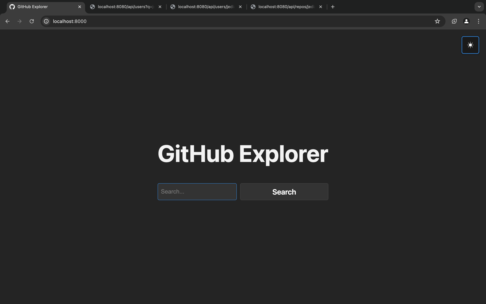
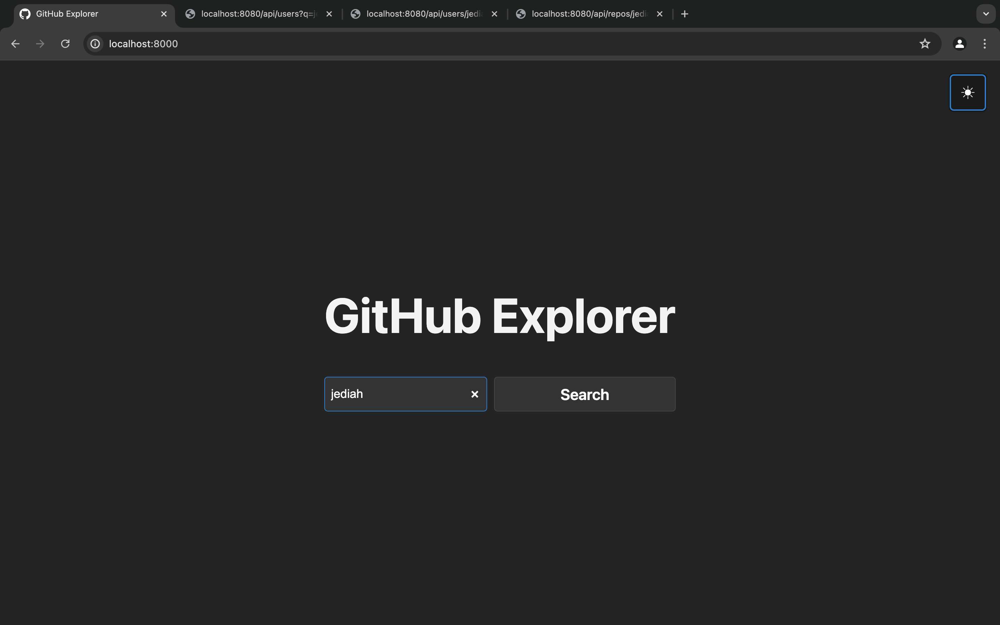
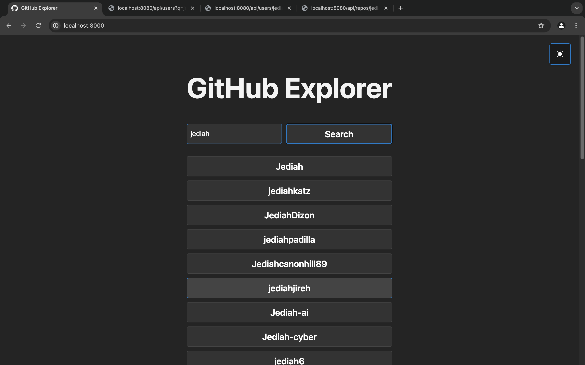
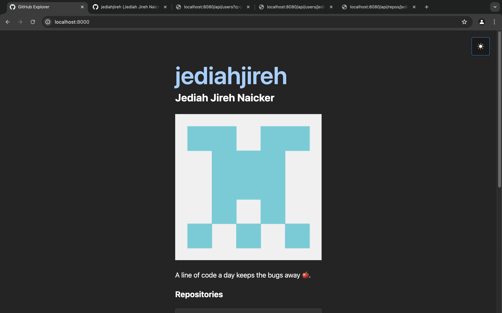
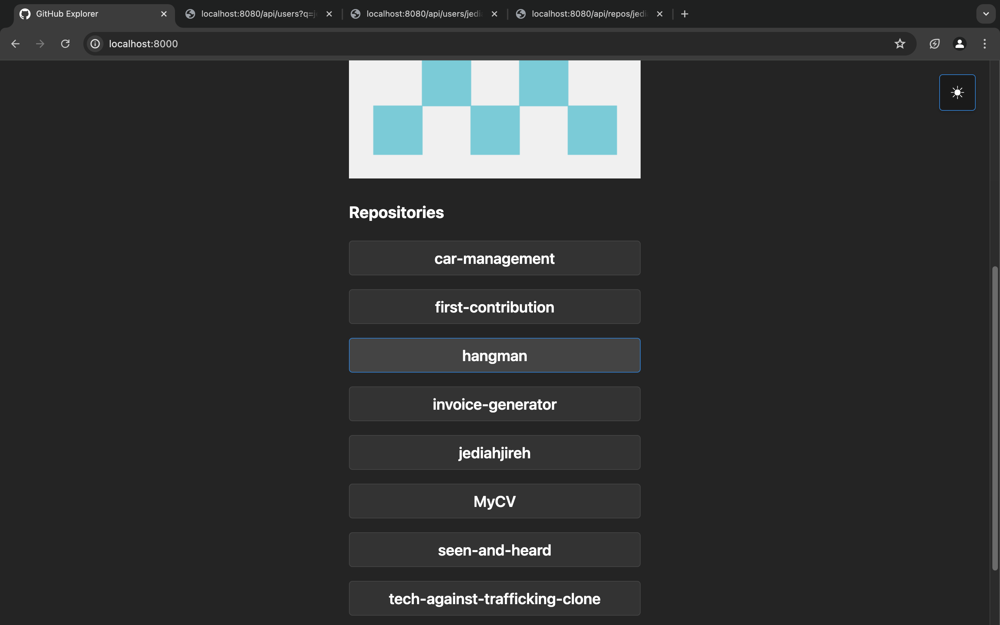
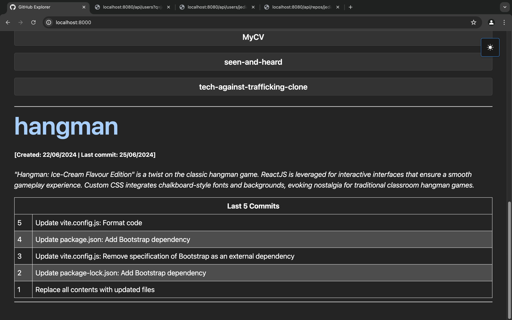

# GitHub Explorer Frontend

This is the frontend for the GitHub Explorer project, built with React. It allows users to search for GitHub users, view user details and explore repositories along with recent commits.

## Table of Contents

- [Installation](#installation)
- [Configuration](#configuration)
- [Usage](#usage)
- [Features](#features)
- [Screenshots](#screenshots)

## Installation

1. Navigate to the frontend directory after cloning the project repository:

```sh
git clone https://github.com/jediahjireh/github-explorer.git
cd github-explorer
cd backend
cd frontend
```

2. Install dependencies:

```sh
npm install
```

3. Ensure the backend server is running on port 8080.

## Configuration

In the `vite.config.js`, make sure the proxy is set to match your backend's API port:

```javascript
server: {
  // desired port for Vite development server
  port: 8000,
  proxy: {
    '/api': {
       // match backend server's port
      target: 'http://localhost:8080/api',
      changeOrigin: true,
      rewrite: (path) => path.replace(/^\/api/, ''),
    },
  },
}
```

Make sure the port for the Vite server (8000) differs from the backend server (8080).

## Usage

Start the development server:

```sh
npm run dev
```

Open your browser and navigate to `http://localhost:8000`.

## Features

- Search for GitHub users by username
- View user details (including repositories)
- Explore repositories with commit history

## Screenshots

See the attached screenshots of the frontend interface in [dark theme](docs/screenshots/dark-mode).

### GitHub Explorer



### GitHub Search



### Search Results



### User Details



### User's Repositories



### Repository Details


